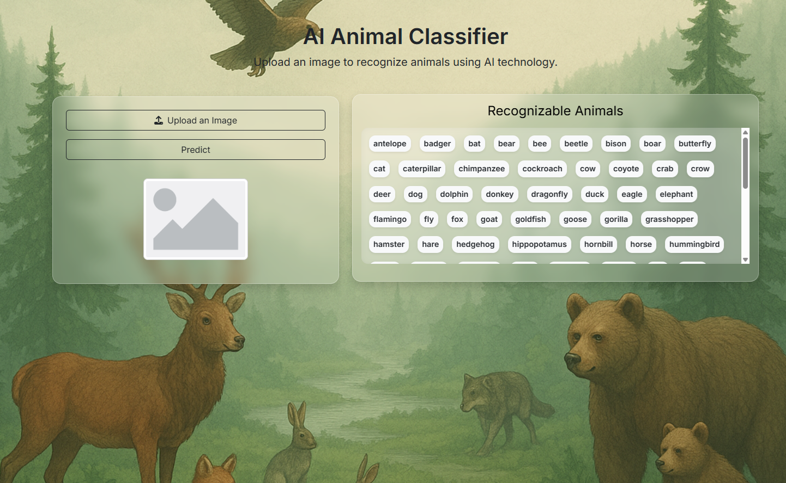
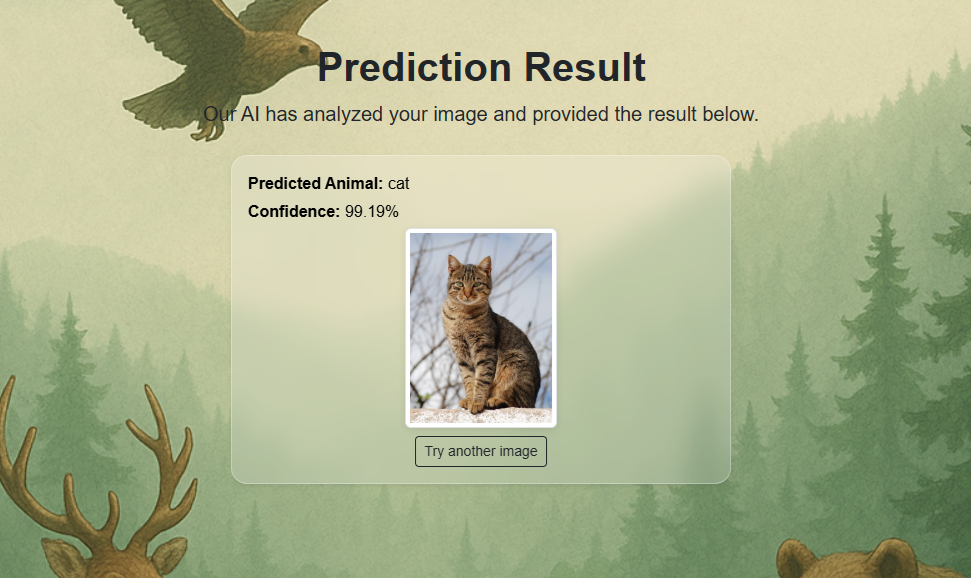

# 🐾 Animal Recognition ML App

A Flask-based web application and REST API for animal image recognition using a **Keras deep learning model** trained in **Google Colab**.  
The app supports both a **web frontend** and a **REST API** (with Swagger UI) for uploading images and receiving prediction results.

---

## Features

- Image classification using a trained Keras model
- REST API with Swagger documentation (`/docs`)
- Simple web interface for image upload and prediction display
- Confidence-based prediction logic (top-1 or top-K results)
- Modular Flask project structure

## Model

- Framework: **TensorFlow / Keras**
- Training environment: **Google Colab**
- Input: Image files
- Output: Animal class probabilities
- Classes are loaded dynamically from a JSON file

Prediction behavior:

- If confidence ≥ threshold → returns top-1 class
- If confidence < threshold → returns top-K predictions

## Model Download

The trained Keras model can be downloaded from Google Drive:

- https://colab.research.google.com/drive/1AvL1NyTEyRw418cxBqEnUDbH4zTflJ3N?usp=sharing

After downloading, place the file here: `modell/animals.keras`

## Frontend

- Upload an image via the web form
- View predicted animal(s) and confidence
- Displays uploaded image and results

See page screens below:  
  


## Installation

### 1. Clone the repository

```bash

git clone https://github.com/Anastasia-Su/ai-animal-recognition.git

python -m venv venv
source venv/bin/activate   # Linux / macOS
venv\Scripts\activate      # Windows
pip install -r requirements.txt
python app.py
```

- Web UI: http://127.0.0.1:5000/
- API docs (Swagger): http://127.0.0.1:5000/docs

## Model Training

### Dataset Structure

- This dataset is used: https://www.kaggle.com/datasets/iamsouravbanerjee/animal-image-dataset-90-different-animals

- The dataset is organized using one folder per class.
- Each folder name represents a class label.
- Classes with fewer than **10 images** are automatically removed before training to ensure stability.

### Data Preprocessing & Augmentation

During training, images are:

- Resized to **160 × 160**
- Normalized to the range **[0, 1]**

The following data augmentations are applied:

- Random rotation (up to 40°)
- Width and height shifts
- Shear and zoom
- Horizontal flip
- Brightness variation
- Nearest-neighbor fill for empty pixels

A validation split of **20%** is created automatically from the dataset.

### Model Architecture

- Backbone: **MobileNetV2** (pre-trained on ImageNet)
- The base model is loaded **without the top classification layer**
- All backbone layers are frozen during training

Custom classification head:

- GlobalAveragePooling2D
- Dense layer (128 units, ReLU)
- Output layer with **softmax** activation

### Class Mapping

- Class names are extracted from dataset folder names
- They are saved to a JSON file during training

### Training Configuration

- Optimizer: Adam (learning rate 0.001)
- Loss function: Categorical Crossentropy
- Metric: Accuracy
- Maximum epochs: 30

### Callbacks

- EarlyStopping:
  monitors validation loss;
  restores best weights.

- ReduceLROnPlateau:
  reduces learning rate when validation loss plateaus.
